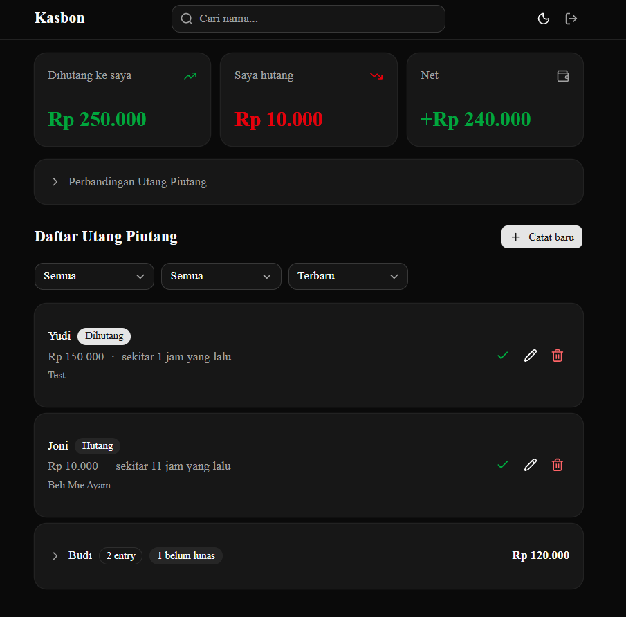

# Kasbon

Web app sederhana buat track utang piutang pribadi. Catat siapa hutang berapa ke kamu, atau kamu hutang berapa ke siapa. Bisa tandai "lunas" kalau sudah dibayar.

## Demo

🔗 [kasbon-app-halo.vercel.app](https://kasbon-app-halo.vercel.app)



## Tech Stack

### Wajib

- **Next.js 16 (App Router) + TypeScript** 
- **Tailwind CSS v4** 
- **Supabase (PostgreSQL + Auth)** 
- **Lucide React** 

### Tambahan 

- **[Zod](https://zod.dev)** — TypeScript-first schema validation. Dipakai untuk validasi input di API endpoints dan form. Alasan: type safety otomatis (tidak perlu manual type casting), dan error messages customizable
- **[Recharts](https://recharts.org)** — Charting library untuk React. Dipakai untuk bar chart perbandingan utang. Alasan: declarative API, responsive built-in, dan mudah customize.
- **[shadcn/ui](https://ui.shadcn.com)** — Component library berdasarkan Radix UI + Tailwind. Dipakai untuk Button, Card, Dialog, Select, dll. Alasan: copy-paste (tidak ada dependency), fully customizable, dan aksesibel.
- **[date-fns](https://date-fns.org)** — Utility library untuk manipulasi tanggal. Dipakai untuk format relative date ("3 hari lalu"). Alasan: immutable, dan support locale Indonesia.
- **[next-themes](https://github.com/pacocoursey/next-themes)** — Theme management untuk Next.js. Dipakai untuk dark mode theme.


## Features

- ✅ Auth (signup, login, logout) dengan Supabase
- ✅ CRUD utang piutang
- ✅ Summary cards (total dihutang, total hutang, net)
- ✅ Bar chart perbandingan
- ✅ Filter (status, tipe) + sort (terbaru, terlama)
- ✅ Search by nama orang (API-based)
- ✅ Auto-group entries dengan nama yang sama
- ✅ Toggle settled/unsettled
- ✅ Confirm dialog sebelum logout & hapus
- ✅ Dark mode
- ✅ Format Rupiah (`Rp 1.234.000`)
- ✅ Relative date (`3 hari lalu`)
- ✅ Mobile-first responsive design
- ✅ RLS (Row Level Security) — user hanya bisa akses data miliknya

## Setup

### 1. Clone & install

```bash
git clone https://github.com/yuliussetyawan/kasbon-app
cd kasbon
npm install
```

### 2. Environment variables

Buat file `.env.local`:

```env
NEXT_PUBLIC_SUPABASE_URL=your_supabase_url
NEXT_PUBLIC_SUPABASE_ANON_KEY=your_supabase_anon_key
```

### 3. Database migration

Buka **Supabase Dashboard → SQL Editor**, paste isi `utils/supabase/migrations/001_create_debts.sql`, jalankan.

### 4. Run local

```bash
npm run dev
```

Buka [http://localhost:3000](http://localhost:3000)

## API Endpoints

| Method | Path | Fungsi |
|--------|------|--------|
| `GET` | `/api/debts` | List debts (query: `?status=`, `?type=`, `?search=`, `?sort=`) |
| `POST` | `/api/debts` | Buat entry baru |
| `PATCH` | `/api/debts/[id]` | Update termasuk tandai lunas |
| `DELETE` | `/api/debts/[id]` | Hapus entry |

Semua endpoint wajib auth + validasi Zod.

## Database Schema

```sql
debts
├── id (uuid, PK)
├── user_id (uuid, FK → auth.users)
├── type (enum: owed_to_me / i_owe)
├── counterpart_name (text, max 100)
├── amount (bigint, Rupiah utuh)
├── note (text, nullable, max 200)
├── due_date (date, nullable)
├── settled_at (timestamptz, nullable)
├── created_at (timestamptz)
└── updated_at (timestamptz, auto via trigger)
```

**RLS Policies:** SELECT, INSERT, UPDATE, DELETE — semua scope ke `auth.uid() = user_id`.

## Approach

Yang saya banggakan dari project ini adalah fitur **auto-grouping by nama**. Jadi kalau ada beberapa data utang dengan orang yang sama, akan grouping otomatis menjadi satu grup yang dapat di-expand dan tidak perlu toggle manual. 

Alasannya secara UX, kalau saya punya 3 utang dengan Budi, lebih mudah dilihat sebagai satu kesatuan bukan 3 card terpisah. Grouping dilakukan di client side karena datanya sudah di-fetch. Apabila datanya sudah ribuan, baru pindahkan ke server menggunakan SQL `GROUP BY`.

## Trade-off

Kalau ada 1 hari lagi, yang saya polish:

1. **Pagination** — sekarang fetch semua data sekaligus. Dengan pagination, load time lebih cepat untuk data besar.
2. **Global State Management** — pakai Zustand atau Redux untuk mengelola state yang kompleks secara terpusat untuk menghindari props drilling.
3. **Export data** — fitur export ke CSV/Excel buat backup atau laporan.

## Time Spent

~4 jam total:
- Setup & auth: 30 menit
- Database & API: 45 menit
- Dashboard UI: 1 jam
- Form & validation: 30 menit
- Bonus features (search, sort, grouping, chart): 45 menit
- Polish (confirm dialog, dark mode, responsive): 30 menit